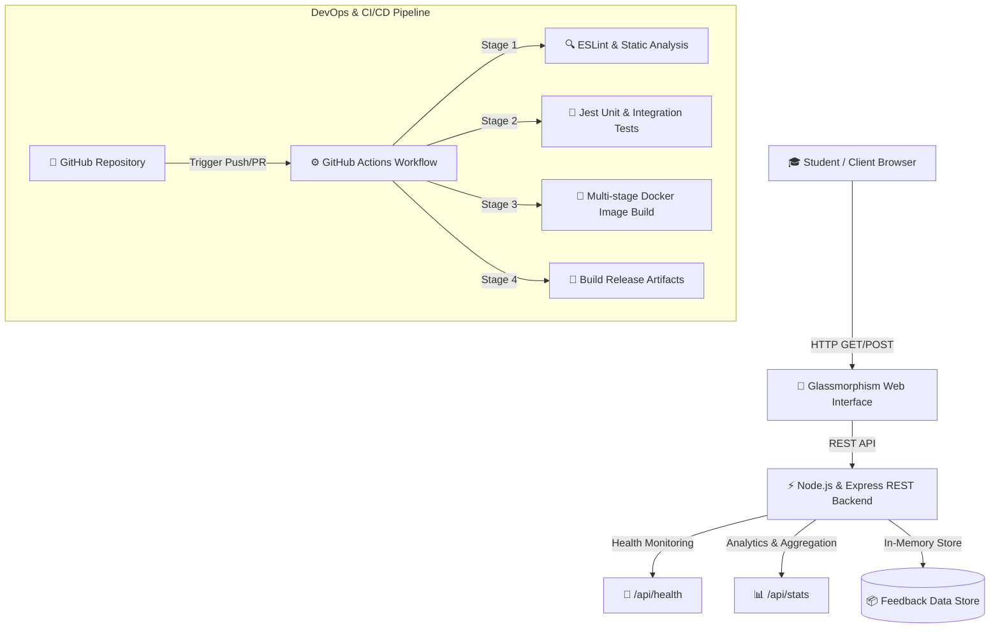

# 🎓 EduPulse - Student Feedback Web Application & DevOps CI/CD Pipeline


An **ultra-premium, production-grade Student Feedback Application** equipped with automated CI/CD pipelines, containerization, real-time analytics dashboard, and automated testing suite. Built for the **DevOps Practical Assessment**.

---

## 🌟 Key Features & Highlights

- **Ultra-Modern UI/UX**: Built with a sleek dark glassmorphism design system, interactive 5-star rating component, course selection, and sentiment feedback labels.
- **Real-Time Analytics Dashboard**: Live metrics for Total Submissions, Average Satisfaction Rating, and Active Courses.
- **Search & Filtering**: Instantly search feedback by student name, comments, or filter by course.
- **Robust REST API Backend**: Modular Express.js microservice architecture with structured controllers, input validation, and health monitoring endpoints.
- **Automated Testing Suite**: Comprehensive unit and integration test coverage using Jest and Supertest.
- **Production-Ready Containerization**: Optimized multi-stage `Dockerfile` (Alpine Linux base, non-root user execution, explicit health check probes).
- **Automated CI/CD Pipeline**: GitHub Actions workflow covering linting, test execution, Docker build verification, and release artifact packaging.

---

## 📐 System Architecture



---

## 🚀 Quick Start Guide

### Prerequisites
- [Node.js](https://nodejs.org/) (v18 or higher)
- [npm](https://www.npmjs.com/) (v9 or higher)
- Optional: [Docker](https://www.docker.com/) & Docker Compose

### 1. Local Development Setup

```bash
# 1. Clone or navigate to project directory
cd "Devops practical assessment"

# 2. Install dependencies
npm install

# 3. Start development server
npm run dev

# 4. Open in browser
# Access http://localhost:3000
```

### 2. Run Automated Test Suite & Code Quality Checks

```bash
# Run unit & integration tests
npm test

# Run ESLint code quality check
npm run lint

# Generate test coverage report
npm run test:coverage
```

---

## 🐳 Docker Deployment

### Building & Running with Docker

```bash
# Build multi-stage Docker image
docker build -t edupulse-feedback-app:latest .

# Run Docker container
docker run -d -p 3000:3000 --name edupulse-app edupulse-feedback-app:latest

# Check container logs & health
docker logs edupulse-app
curl http://localhost:3000/api/health
```

### Running with Docker Compose

```bash
# Launch containerized service
docker compose up -d --build

# Stop service
docker compose down
```

---

## 📡 REST API Reference

| Endpoint | Method | Description | Request Body / Query |
| :--- | :--- | :--- | :--- |
| `/api/health` | `GET` | System health check probe & uptime stats | N/A |
| `/api/feedback` | `GET` | Retrieve student feedback entries | Optional query: `?course=...&search=...` |
| `/api/feedback` | `POST` | Submit new student feedback | JSON: `{ studentName, course, rating, category, feedback }` |
| `/api/stats` | `GET` | Aggregate satisfaction metrics | N/A |

### Example POST Request Payload

```json
{
  "studentName": "Alex Rivera",
  "course": "DevOps & Cloud Engineering",
  "rating": 5,
  "category": "Course Content",
  "feedback": "Automated GitHub Actions CI/CD pipeline and Docker containerization were super easy to understand!"
}
```

---

## ⚙️ CI/CD Pipeline Architecture (`.github/workflows/ci-cd.yml`)

The CI/CD pipeline consists of four automated stages triggered on every push or pull request:

1. **Lint & Static Check**: Runs ESLint to enforce JavaScript standards and prevent syntax defects.
2. **Unit & Integration Tests**: Executes Jest test suite against all API endpoints and uploads code coverage artifacts.
3. **Docker Build Verification**: Validates `Dockerfile` syntax and builds container image via Buildx.
4. **Continuous Deployment Packaging**: Bundles verified production code into downloadable release artifacts.

---

## 🛠️ Tech Stack Summary

- **Frontend**: HTML5, Vanilla CSS3 (Glassmorphism design system), Vanilla JavaScript (ES6+), FontAwesome Icons, Google Fonts.
- **Backend**: Node.js, Express.js, Cors, Morgan logger.
- **Testing & QA**: Jest, Supertest, ESLint.
- **DevOps Tools**: Docker (Multi-stage), Docker Compose, GitHub Actions, Healthcheck Probes.

---

## 📄 License
This project is licensed under the [MIT License](LICENSE).
